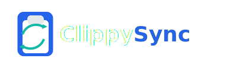

# ClippySync
<p align="center">
  
</p>

ClippySync is a small .NET web API that provides clipboard synchronization features between devices on the same machine or trusted devices. It includes a simple device-key based authentication handler that authenticates requests using a header containing the device identifier (by default this project uses the machine name).

Key points
- Lightweight minimal API built with .NET 8
- Custom authentication scheme that validates a device key header (`X-Device-Key`) against the current machine name
- Swagger/OpenAPI available for interactive testing; you can add a header parameter to the `/clipboard` endpoint so Swagger UI accepts the device-key as input

Authentication
- Header name: `X-Device-Key`
- Handler: `DeviceKeyAuthenticationHandler` (file: `DeviceKeyAuthenticationHandler.cs`)
- Behavior: if the header value matches `Environment.MachineName` (case-insensitive), the request is authenticated; otherwise it fails.

Running locally

- Build and run the API:

```powershell
# from the project directory
dotnet build ; dotnet run
```

- Open Swagger UI (usually at `https://localhost:5030/swagger` or check the URL printed in the console).

Example curl request

```powershell
# replace <machine-name> with the machine name or value your handler expects
curl -H "X-Device-Key: <machine-name>" https://localhost:5030/clipboard
```

Contact
- For questions, open an issue in the repository or contact the author directly.
