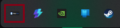
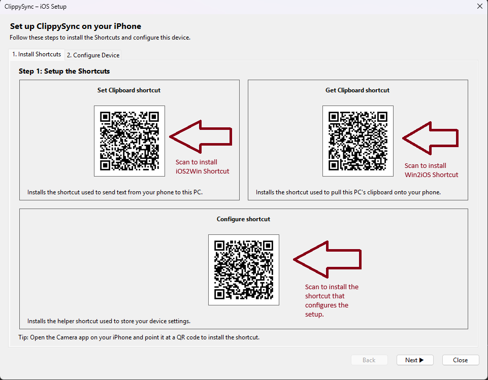
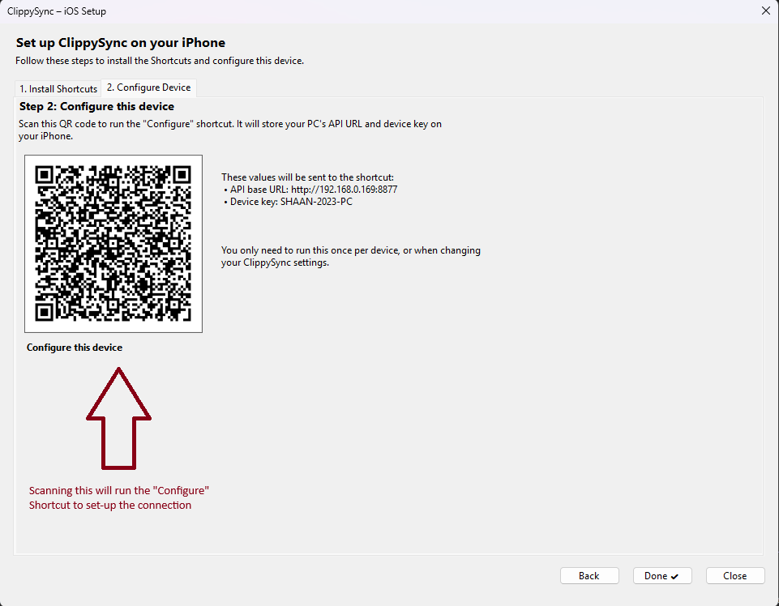
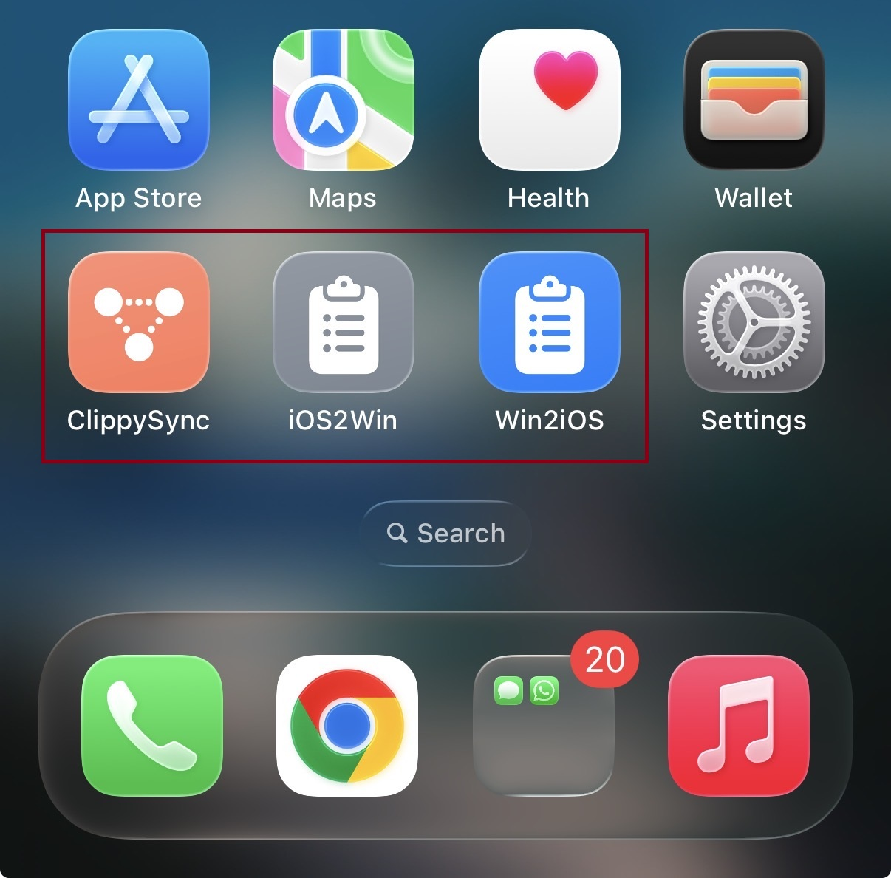
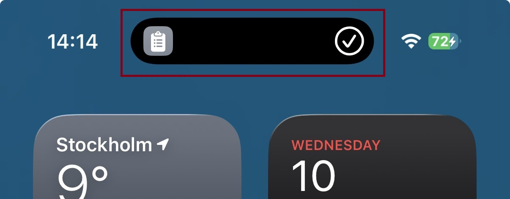
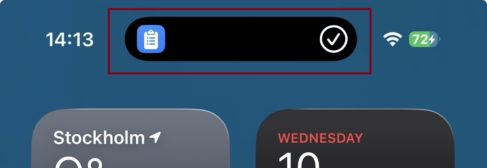

# ClippySync

<p align="center">
  
</p>

ClippySync is a lightweight local-network clipboard synchronization tool that runs as a Windows System Tray application. It hosts a local .NET Web API that allows trusted iOS devices on your network (via iOS Shortcuts) to read from and write to your computer's clipboard (only text for now).

## Features

- **System Tray Integration**: Runs quietly in the background with a tray icon.
- **Clipboard API**:
  - `GET /clipboard`: Retrieve text from the PC clipboard.
  - `POST /set-clipboard`: Send text to the PC clipboard.
- **Simple Authentication**: Secures endpoints using a device key header (defaults to the host Machine Name).
- **Connection Info**: Easily view your local IP and connection URL via the tray menu.

## Project Structure

- **[ClippySync.Tray](ClippySync.Tray/ClippySync.Tray.csproj)**: A Windows Forms application that hosts the web server and manages the system tray icon.
- **[ClippySync.Web](ClippySync.Web/ClippySync.Web.csproj)**: The ASP.NET Core Web API logic that handles the actual clipboard operations and authentication.

## Getting Started

### Running the Application

1. Build the solution.
2. Run the `ClippySync.Tray` project.
3. An icon will appear in your system tray.
4. Click the icon (or right-click and select "Show connection info") to see the IP address and port (default: `8877`).

### Running via Command Line (Dev)

You can also run the web API standalone without the tray icon:

```powershell
cd ClippySync.Web
dotnet run
```

## API Usage

### Authentication

Requests to clipboard endpoints require the `X-Device-Key` header.
- **Header Name**: `X-Device-Key`
- **Value**: Must match the host's `Environment.MachineName` (case-insensitive).

### Endpoints

| Method | Endpoint | Description |
| :--- | :--- | :--- |
| `GET` | `/clipboard` | Returns the current text in the host clipboard. |
| `POST` | `/set-clipboard` | Sets the host clipboard to the text provided in the request body. |
| `GET` | `/get-device-name` | Returns the machine name (no auth required). |

### Examples

**Get Clipboard:**
```bash
curl -H "X-Device-Key: MY-PC-NAME" http://192.168.1.x:8877/clipboard
```

**Set Clipboard:**
```bash
curl -X POST -H "X-Device-Key: MY-PC-NAME" -d "Hello World" http://192.168.1.x:8877/set-clipboard
```

## iOS Shortcuts

This tool is designed to work with iOS Shortcuts. There are three shortcuts that the tool requires:

- **iOS2Win**: Put the iOS clipboard content on Windows clipboard.
- **Win2iOS**: Get the Windows clipboard content on iOS clipboard.
- **ClippySync**: A configuration shortcut that will setup the two shortcuts above with the connection details.

### Setup and Usage

| Step | Description | Screenshot |
| :--- | :--- | :--- |
| 1. | Run the application and click the tray-icon to open the connection wizard. |  |
| 2. | Follow the instructions on the Connection Wizard to scan the QR code. This will create the required shortcuts on your iPhone. |  <br>  |
| 3. | You will now have three new shortcuts on your iPhone. |  |
| 4. | To send clipboard contents from **iPhone -> Windows**, run the `iOS2Win` shortcut. You will get a confirmation notification. |  |
| 5. | To send clipboard contents from **Windows -> iPhone**, run the `Win2iOS` shortcut. The clipboard content will be copied to your iPhone. |  |

> Tip: If your network assigns IPs dynamically, consider running the configure shortcut to setup the right IP.